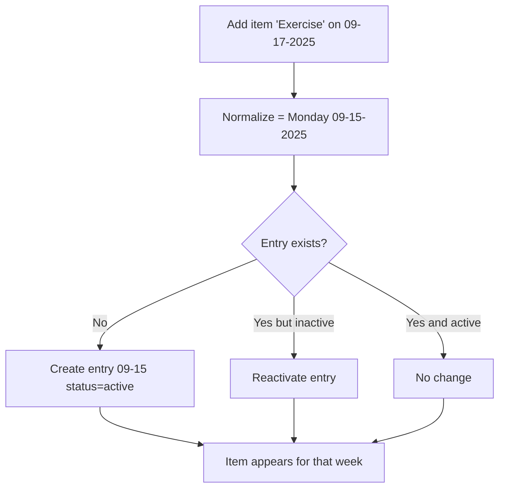
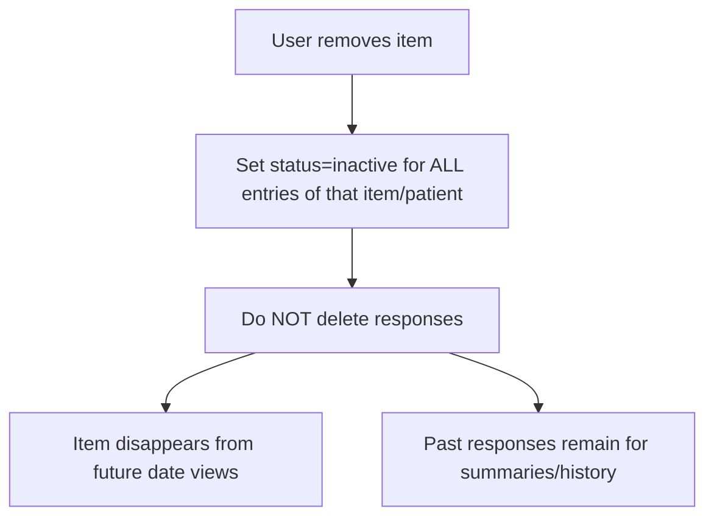

## Track Module — End-to-End Flow (Simple, Practical Guide)

This document explains how tracking works in the app: what’s stored, when entries appear, how progress is calculated, and what happens when users add/remove items. Examples and flowcharts included.

### Core Concepts

- **Track Category**: Group of related items (e.g., “Vitals”).
- **Track Item**: A specific thing to record (e.g., “Blood Pressure”), with a `frequency` (daily | weekly | monthly) and `status` (active | inactive).
- **Question**: Prompts under an item (e.g., “Systolic”, “Diastolic”), with types (boolean | mcq | msq | numeric | text). Questions have `status=active|inactive`.
- **Track Item Entry**: A patient-specific instance of an item on a date. Has `status=active|inactive` to support soft-deletes and history.
- **Track Response**: A patient’s answer to a question for a specific entry. Preserved even if entries become inactive (for summaries/history).

Key tables used: `TRACK_CATEGORY`, `TRACK_ITEM`, `QUESTION`, `RESPONSE_OPTION`, `TRACK_ITEM_ENTRY`, `TRACK_RESPONSE`.

### Frequencies and Dates

- **Daily**: The entry’s date is the same day the user selects.
- **Weekly**: The entry’s date is the Monday of the selected week.
- **Monthly**: The entry’s date is the 1st of the selected month.

Date normalization happens whenever you add or load for a day. To optimize performance, entries are lazily created only when the user selects a date.

Examples:
- Daily: Select 09-17-2025 → entry on 09-17-2025.
- Weekly: Select 09-17-2025 (Wed) → entry on 09-15-2025 (the week’s Monday).
- Monthly: Select 09-17-2025 → entry on 09-01-2025.

### Load-on-Select (Lazy Creation)

When you open Track for a date:
- The UI calls `getTrackCategoriesWithItemsAndProgress(patientId, date)`.
- Before loading, the service ensures entries for that date ONLY for items the patient is already subscribed to (has any active entry) and whose frequency matches the date (daily/that Monday/1st of month).
- Then it loads entries for that normalized date with `status='active'` only.

Result: Items appear automatically on relevant dates without pre-creating entries for all days/weeks/months.

### Adding Items

Function: `addTrackItemOnDate(itemId, userId, patientId, date)`

- Normalizes `date` by the item’s `frequency`.
- If an entry exists for `(patientId, itemId, normalizedDate)`:
  - If inactive → reactivates (`status='active'`).
  - If active → no-op.
- If no entry exists → inserts a new `TRACK_ITEM_ENTRY` with `status='active'`.

Effect: The item becomes visible for that normalized date (and future relevant dates via lazy creation).

Example (Weekly):
- User selects 09-17-2025 and adds “Exercise” (weekly).
- Normalized date = Monday 09-15-2025.
- App creates/reactivates the entry at 09-15-2025.
- Next week, when user clicks any day in that week, the service lazily creates/reactivates Monday’s entry for that new week.

### Removing Items

Function: `removeTrackItemFromDate(itemId, userId, patientId, date)`

- Soft-deletes by setting `status='inactive'` on all entries for the item/patient across all dates (past and future).
- Responses are preserved; they remain available for summaries/history.

Why soft-delete? We must keep historical answers for summary, audits, and analytics.

### Listing Items to Add

Function: `getAllCategoriesWithSelectableItems(patientId, date)`

- Returns all `status='active'` categories and items (ignores the date for item details).
- Marks `selected=true` if the patient has any `status='active'` entry for that item on any date.
- Lets the user toggle selection (add = create/reactivate; remove = inactivate all entries).

### Viewing Progress

Function: `getTrackCategoriesWithItemsAndProgress(patientId, date)`

- Filters by:
  - `TRACK_CATEGORY.status='active'`
  - `TRACK_ITEM.status='active'`
  - `QUESTION.status='active'`
  - `TRACK_ITEM_ENTRY.status='active'`
- For each visible item (at the normalized date), progress is:
  - completed = distinct answered questions for that entry
  - total = distinct active questions for the item
- Also fetches item-level summaries.

Example:
- “Blood Pressure” has 2 active questions.
- Patient answered both → completed=2, total=2 → progress 100%.

### Summaries

- Summaries are generated per entry by evaluating each question’s `summary_template` against its stored answer.
- Deactivated entries don’t display in the active list, but their responses still exist, so historical summaries can still be derived when needed.

### Status Rules

- Category/Item/Question `status='inactive'` → they don’t appear or count.
- Entry `status='inactive'` → hidden from lists and progress but responses remain in `TRACK_RESPONSE`.
- Removing an item = set all its entries to `inactive` for that patient.
- Adding an item on a date = create/reactivate the entry for the frequency-normalized date.

---

## Flowcharts (Mermaid)

### 1) Daily Load Flow (Example: Select 09-17-2025)

```mermaid
flowchart TD
  A[User selects 09-17-2025] --> B[Normalize date (Daily) = 09-17-2025]
  B --> C[Find subscribed items for patient]
  C --> D{Entry exists for 09-17-2025?}
  D -- No --> E[Create entry 09-17-2025 status=active]
  D -- Yes but inactive --> F[Reactivate entry]
  D -- Yes and active --> G[No change]
  E --> H[Load items & progress]
  F --> H
  G --> H
  H --> I[Render daily items for 09-17-2025]
```

### 2) Weekly Load Flow (Example: Select Wed 09-17-2025)

```mermaid
flowchart TD
  A[User selects 09-17-2025] --> B[Normalize (Weekly) = Monday 09-15-2025]
  B --> C[Find subscribed weekly items]
  C --> D{Entry exists for 09-15-2025?}
  D -- No --> E[Create entry 09-15-2025 status=active]
  D -- Yes but inactive --> F[Reactivate entry]
  D -- Yes and active --> G[No change]
  E --> H[Load items & progress for 09-15-2025]
  F --> H
  G --> H
  H --> I[Render weekly items mapped for the selected date]
```

### 3) Monthly Load Flow (Example: Select 09-17-2025)

```mermaid
flowchart TD
  A[User selects 09-17-2025] --> B[Normalize (Monthly) = 09-01-2025]
  B --> C[Find subscribed monthly items]
  C --> D{Entry exists for 09-01-2025?}
  D -- No --> E[Create entry 09-01-2025 status=active]
  D -- Yes but inactive --> F[Reactivate entry]
  D -- Yes and active --> G[No change]
  E --> H[Load items & progress for 09-01-2025]
  F --> H
  G --> H
  H --> I[Render monthly items mapped for the selected date]
```

### 4) Add Item Flow (Weekly Example)



### 5) Remove Item Flow (Soft Delete, Preserve Responses)



---

## Minimal API Cheat Sheet

- `getTrackCategoriesWithItemsAndProgress(patientId, date)`
  - Lazily ensures entries for subscribed items on the selected date (normalized), then returns items with progress and summaries.
- `getAllCategoriesWithSelectableItems(patientId, date)`
  - Shows all active categories/items; `selected=true` if any active entry exists for the patient.
- `addTrackItemOnDate(itemId, userId, patientId, date)`
  - Create/reactivate the entry for the frequency-normalized date.
- `removeTrackItemFromDate(itemId, userId, patientId, date)`
  - Soft-delete (set inactive) across all dates for that item/patient; preserves responses.